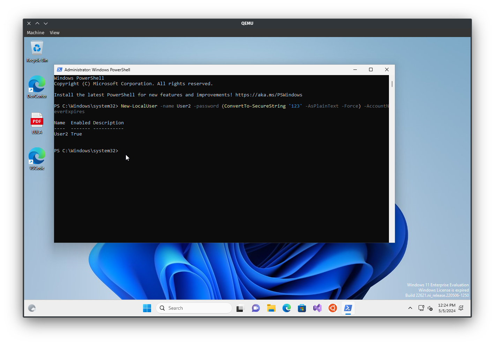
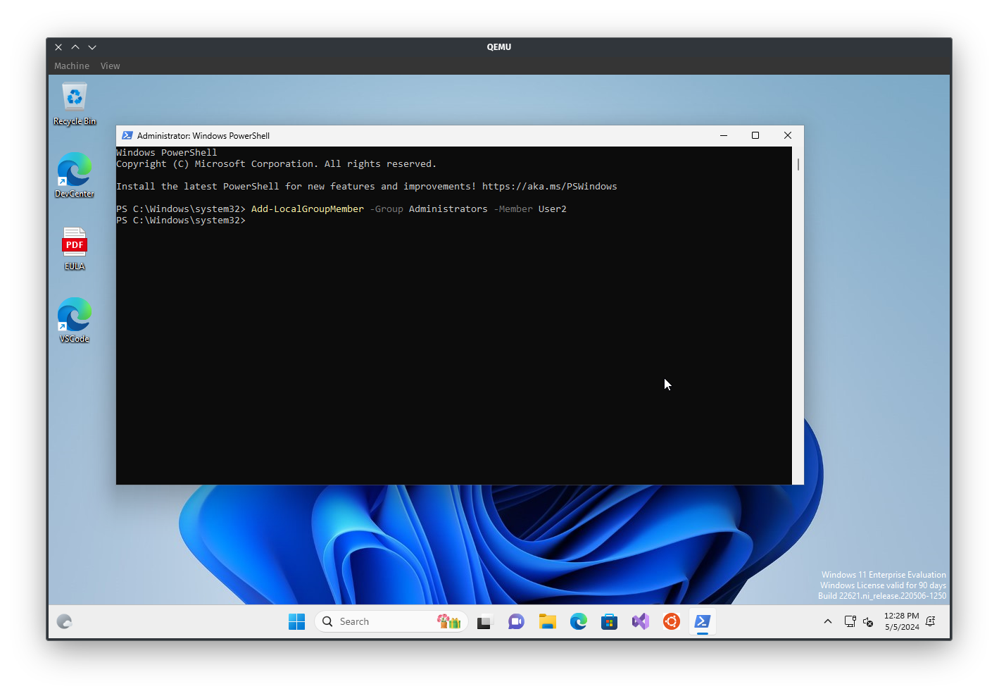
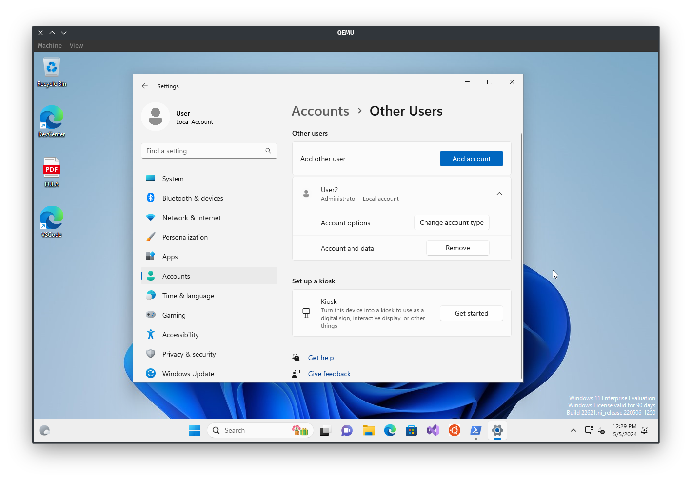
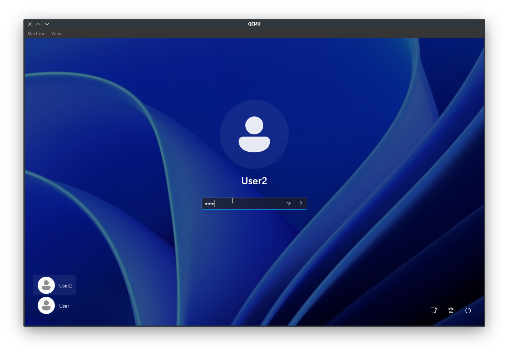
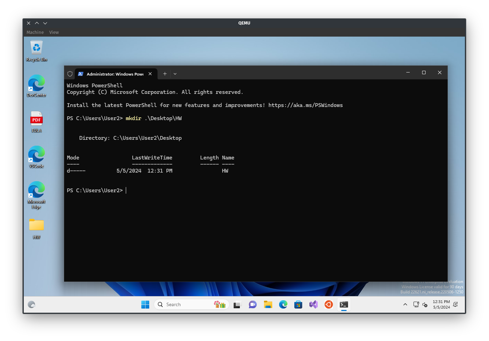
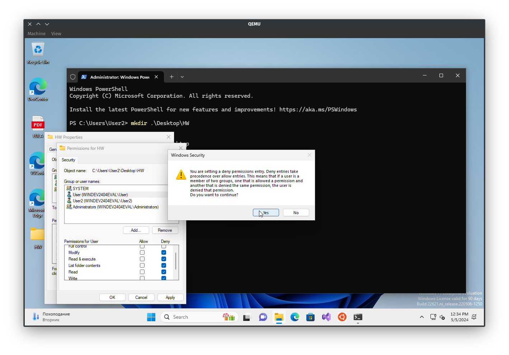
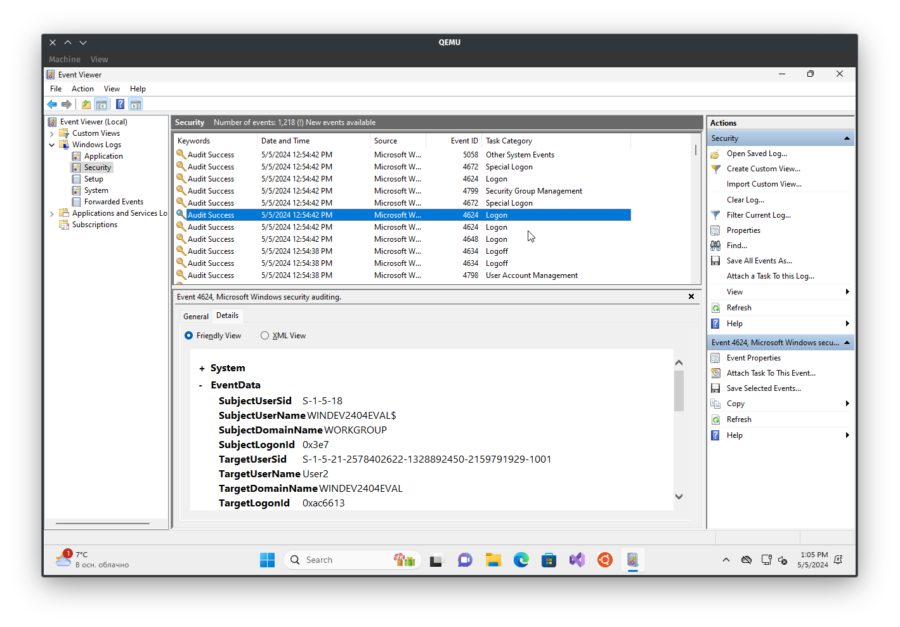
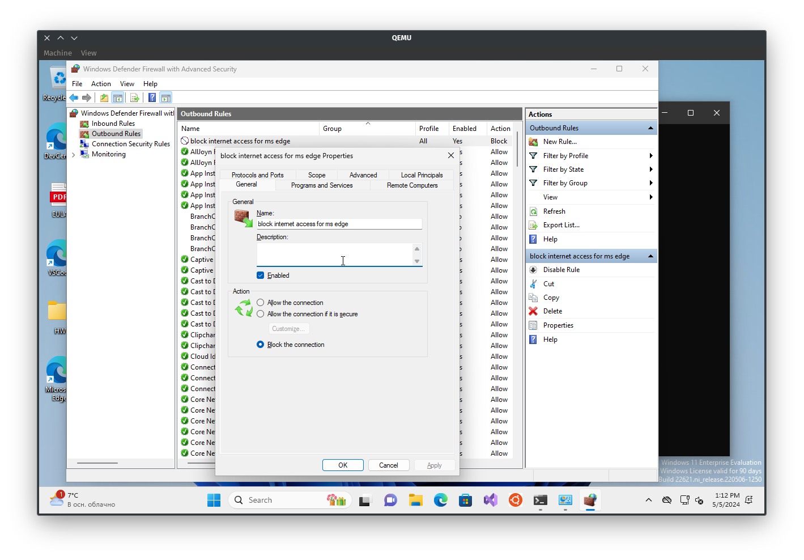
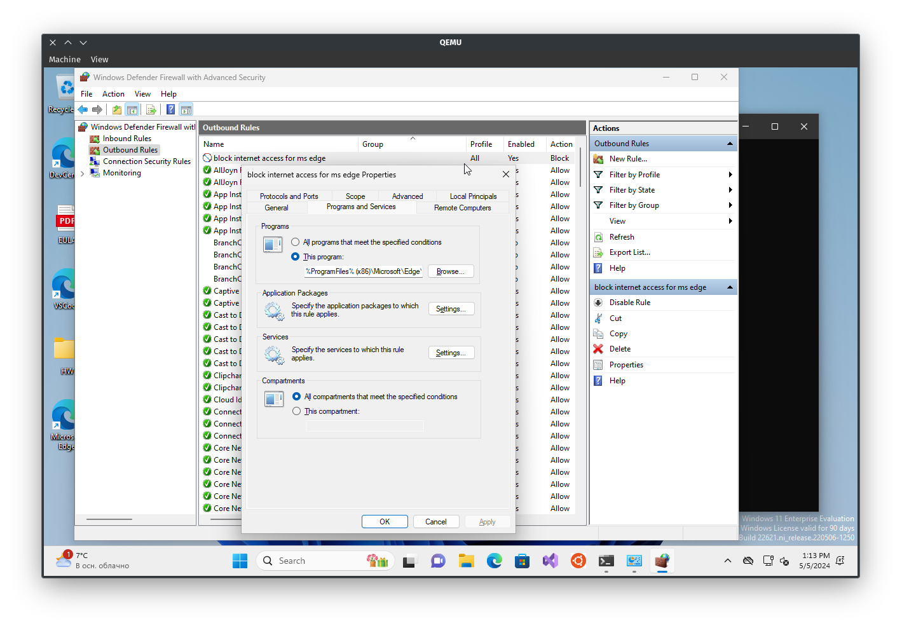
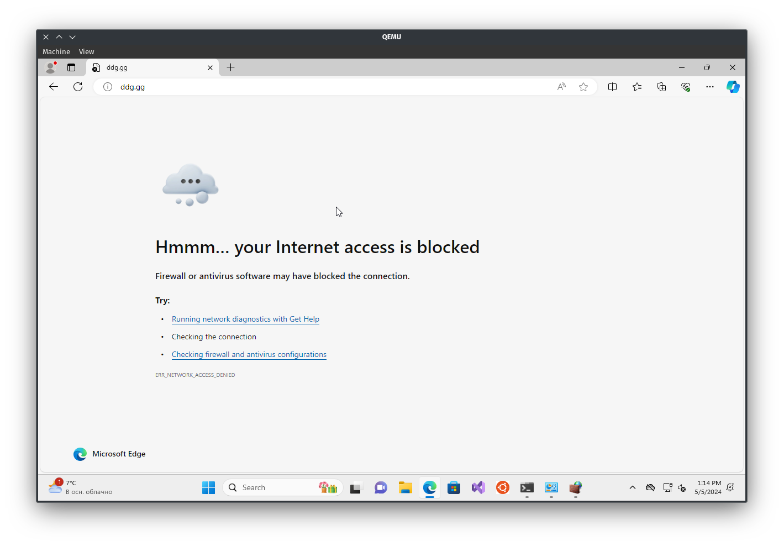

# Windows 11 basic usage

## Create a user and assign administrator privileges

## Authorization, folder creation and restriction

## Viewing Event Log and confirming logon

## Create firewall rule to restrict MS Edge

